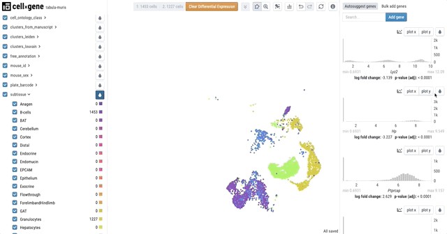

# Features

### Cross-filter cells and color by metadata

### Compare groups of cells with differential expression

### See how metadata and gene expression break down across categories

### Find cells where a gene is expressed

### Compare expression of multiple genes

# Interactive demos

Several groups have independently [deployed](hosted) various versions of cellxgene to the web.
Check out the cool data that our users are using cellxgene to explore!

### [Kidney cell atlas](https://www.kidneycellatlas.org/)

### [Tabula muris senis](https://tabula-muris-senis.ds.czbiohub.org/)

### [Hemocytes](https://hemocytes.cellgeni.sanger.ac.uk/)

### [Melanoma](https://melanoma.cellgeni.sanger.ac.uk/)

### [CZI's own cellxgene site](https://cellxgene.cziscience.com/)

_Want us to link to your dataset here? [Just send us a note!](contact)_
