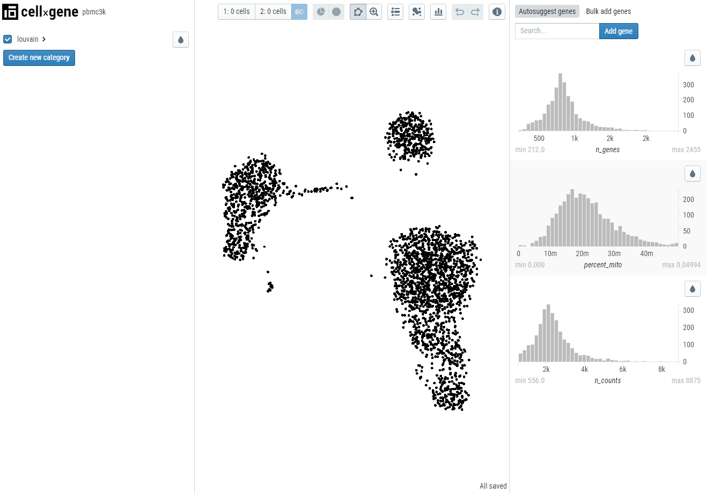

# Launching cellxgene with your dataset

## Quickstart

Once you've [prepared your data](prepare) for cellxgene, you can launch the app using

```
cellxgene launch mydataset.h5ad --open
```

You should see your web browser open with the following



**Note**: automatic opening of the browser with the `--open` flag only works on some platforms (eg, OSX). On other platforms you'll need to directly point to the provided link in your browser.

## Launching from a URL

You can also launch from a URL directly like this:

```
cellxgene launch https://github.com/chanzuckerberg/cellxgene/blob/main/example-dataset/pbmc3k.h5ad
```

Support for S3 and GCS is not enabled by default. If you wish to directly access S3 or GFS, install one or both of the following packages:

- [s3fs](https://s3fs.readthedocs.io/en/latest/) for S3 support
- [gcsfs](https://gcsfs.readthedocs.io/en/latest/) for GCS support

For example:

```
pip install s3fs
cellxgene launch s3://mybucket.s3-us-west-2.amazonaws.com/mydata.h5ad
```

## Options for cellxgene `launch`

**For the most up-to-date and comprehensive list of options, run `cellxgene launch --help`**

`--open` automatically opens the web browser after launching (caveat: only works on some operating systems).

`--disable-annotations`, `--annotations-file` & `--annotations-dir` all have to do with creating new categorical annotations in the application. We have a [whole separate page](annotations) about their usage! :)

`--diffexp-lfc-cutoff` as explained [in the methods](methods), genes are only returned in differential expression if the effect size is above the specified threshold for log fold change. Defaults to 0.01.

`--disable-diffexp` will disable and hide the `Compute Differential Expression` feature.
For large datasets, or datasets loaded with the `--backed` option, computing differential expression may
be extremely slow or use excessive resources on the host computer (e.g., memory thrashing).
Disabling the feature will ensure that this computation is not initiated accidentally.

`--backed` option instructs `cellxgene launch` to read the H5AD file in "backed" mode (for more information, see the
[anndata.read_h5ad() documentation](https://anndata.readthedocs.io/en/latest/anndata.read_h5ad.html#anndata.read_h5ad)).

By default, cellxgene will read the entire H5AD will be into memory at startup, improving application speed and performance.
Very large datasets may not fit in memory. The "--backed" mode will read the file incrementally, reducing memory
use, and for large files, improving startup speed. _However_, this option will also significantly slow
down access to gene expression histograms, and may render differential expression calculations too slow
to use (see `--disable-diffexp` for an option to disable this feature).

`--embedding` restricts which embeddings will be available in the viewer. By default, all embeddings specified in `anndata.obsm['X_name']` will be loaded; if you have many embeddings, you may wish to restrict this list for a speedier launch.

`--title` adds a title to the viewer. Defaults to file name.

`--about` adds a link where users can go to find more infomation about the dataset. Requires `https`.

`--obs-names` allows you to specify which column in `anndata.obs` to use as `anndata.obs.index`.

`--var-names` allows you to specify which column in `anndata.var` to use as `anndata.var.index`.

`--max-category-items` omits categorical metadata fields that contain more than N _distinct_ values. Defaults to 1000.
